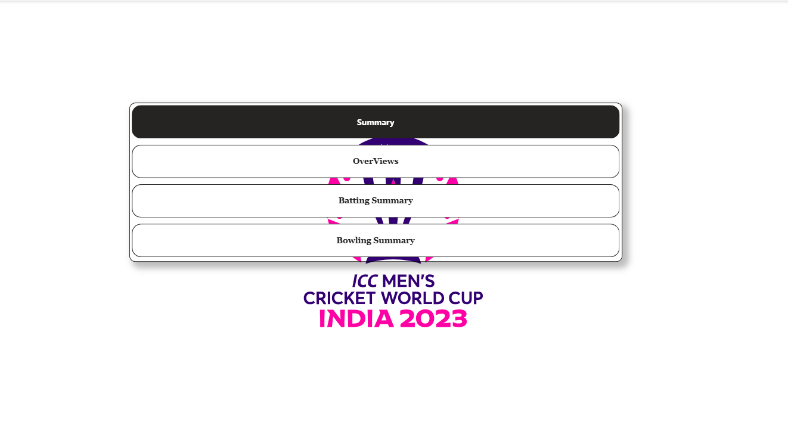
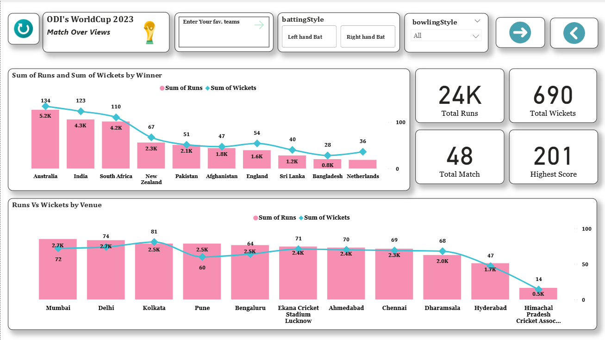
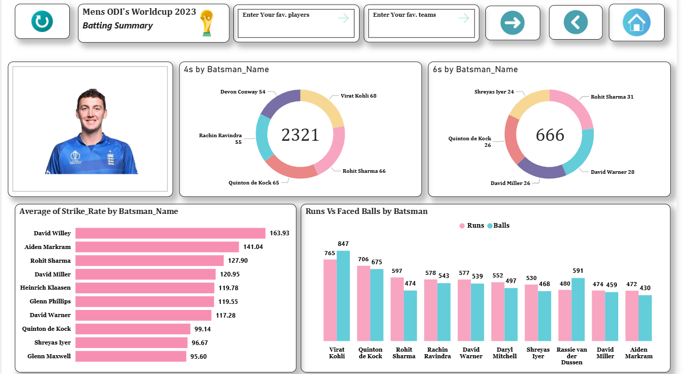
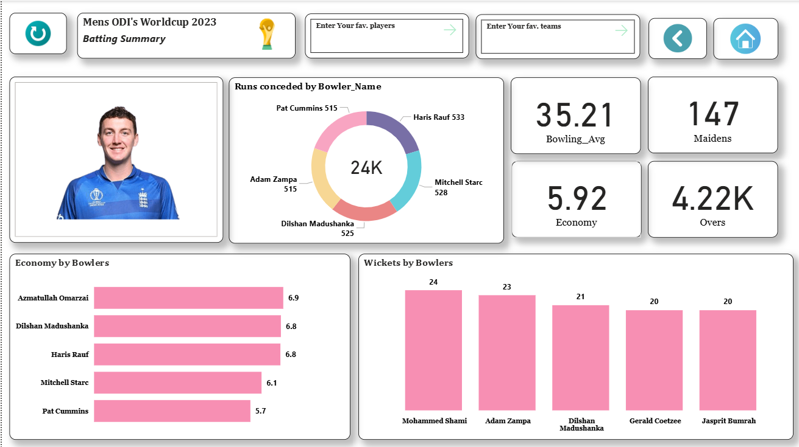

# ICC Men's ODI World Cup 2023 - Power BI Dashboard

## 📊 Project Overview
This project is an interactive Power BI dashboard analyzing the ICC Men's ODI World Cup 2023. The dashboard provides insights into batting performance, bowling performance, venue analysis, and match-level statistics.
--- 
## 🛠 Tools & Technologies Used
- Power BI
- Power Query (Data Cleaning & Transformation)
- DAX (Data Analysis Expressions)
- Data Modeling (Star Schema)
--- 
## 📂 Dataset Includes
- Player Information
- Batting Summary
- Bowling Summary
- Match Schedule & Results
--- 
## 📈 Key Insights
- Total Runs & Wickets by Team
- Venue-wise Performance Analysis
- Batting Metrics (Strike Rate, 4s, 6s)
- Bowling Metrics (Economy, Bowling Average, Maidens)
- Net Run Rate (NRR) Calculation
- Interactive Navigation Across Pages
---
## 🧠 Data Modeling Approach
A star schema data model was implemented:
- Matches table as dimension
- Batting & Bowling tables as fact tables
- Relationships optimized for performance
---
## 📷 Dashboard Preview
### Home 

### OverViews

### Batting Summary

### Bowling Summary

## 🚀 How to Use
1. Download the ODI.pbix file
2. Open in Power BI Desktop
3. Refresh data if required

---

## 👨‍💻 Author
**Ravi Kumar Gupta**  
📍 Delhi, India  

